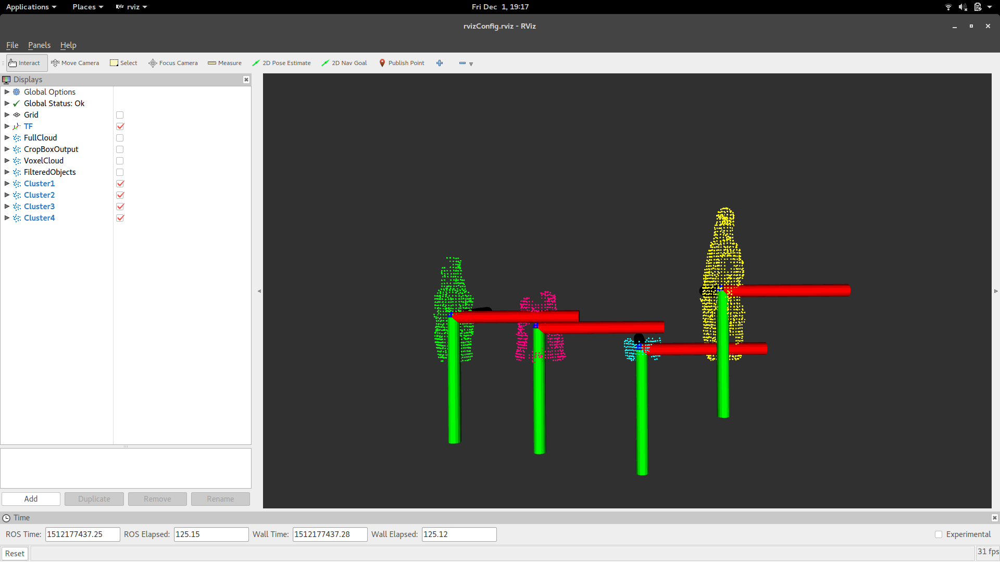

# InspectorBaxter
ME495- Embedded Systems in Robotics Final Project

## Group Members
Hannah Emnett, Aamir Husain, Peng Peng, Srikanth Kilaru, Aaron Weatherly

## Package Structure Overview
`src`: contains the `baxter_speech.py`, `pick_up.py`, `cluster_extracter.cpp`, `pcl_transform.py` and `master.py`   
`msg`: contains `PclData.msg`, `ObjectList.msg`, `State.msg`, `Update.msg`, `Pcl_Update.msg`   
`launch`: contains `move_baxter.launch`, `baxter_speech.launch`, `pcl_extract.launch`, and `master_launch.launch`
`images` and `vocab`: contains images to be displayed to Baxter's screen and contains the necessary vocab for `pocketsphinx`

## Overview of Functionality
### Relevant nodes (not including extra nodes task specific):  
1. `master.py`  
    - Sub: i/master_update, i/pclData2, i/state  
    - Pub: i/obj_list, i/state
2. `pick_up.py`   
    - Sub: i/obj_list   
    - Pub: i/master_update   
3. `baxter_speech.py`   
    - Sub: i/state   
    - Pub: i/state   
4. `cluster_extracter.cpp`   
    - Sub: none  
    - Pub: pclData    
5. `pcl_transform.py`    
    - Sub: pclData   
    - Pub: i/pclData2   

### Relevant topics (not including extra topics task specific):   
1. inspector/state   - State.msg   
2. inspector/obj_list   -ObjectList.msg   
3. pclData   -PclData.msg   
4. inspector/master_update  -Update.msg   
5. inspector/pclData2   - PclData.msg   

### Relevant Msgs:
1. ObjectList.msg (of format: int32 state, int32 next, pcldata objects, int32 obj_index   
2. PclData.msg (of format: point32 centroids, float32 heights, float32 widths, float32 obj_id)   
3. State.msg (of format: int32 state, string name, int32 done)   
4. Update.msg (of format: int8 state, int8 done)      

### Phases:
0- initialize - internal phase   
1- training   
2- sorting   
3- fetching   
4- shutdown   
5- standby - internal phase   

## Breakdown:
phase 0: init  
- User says "Start"
- Startup procedure for all nodes   
- Phase immediately updates to 5 (standby) and master.py publishes on state.msg and obj_list.msg to notify of standby      

phase 1: training   
*Note: Must be first after phase 0*   
- user says "Baxter, learn <object 1 name>"   
- baxter_speech publishes state=1 and name="<object 1 name>" on State.msg
- master is updated of training state   
- master pub pcl_update.msg on i/pcl_req   
- cluster_extractor publishes pcldata.msg on i/pcl_data   
- master publishes objlist on i/obj_list (only first but stores others)   
- pick_up picks up object at centroid and lifts to user. publishes update.msg on i/master update   
- master publishes i/state as a done flag so that baxter_speech is listening      
- master publishes objectlist on i/obj_list (knows to replace object and pick up next object with NEXT flag in objectlist.msg: 0 is first, 1 is pick up next)   
- master stores obj_id as ratio of height and width from i/state   
- User says "Baxter, learn <object 2 name>" (the above two steps loop)   
- if out of objects (master will know), master publishes phase 5 on objectlist.msg on i/obj_list and state.msg on i/state   

phase 2: sort   
- User says "Baxter, sort" (must happen after train but fetch can be first), transitions when in standby   
- baxter_speech pub state=2 in State.msg on i/state   
- master is updated of sorting state   
- master publishes pcl_update.msg on i/pcl_req   
- cluster_extractor publishes pcldata.msg on i/pcl_data   
- master determines obj_ids internally   
- master publishes objlist on i/obj_list   
- pick_up picks up object at centroid and moves to predetermined shelf based on obj id. It internally stores locations of all previously sorted objects. Loops until everything is sorted.   
- Publishes update.msg on i/master update   
- Master publishes on i/state and i/obj_list a state of 5   


phase 3: fetch
- User says "Baxter, fetch <object 1 name>" (must happen after train but sort can be first)   
- baxter_speech pub state=3 and name="<object 1 name>" in State.msg on i/state   
- master is updated of fetch state  
- master pub on i/pcl_req   
- cluster_extractor receives pcl_req from master and returns on pcl_update   
- master looks through list and identifies “can” centroid   
- master pub objectlist.msg on i/obj_list (this message also includes identity), only 1 location or Nans   
- pick_up will test: if all Nans, will look in previously sorted location for objs of correct id, ELSE, will pick up at centroid provided and present to user. Publishes update.msg on i/master_update   
- User says "Baxter, open"   
- baxter_speech publishes standby state on i/state   
- master publishes standby on objectlist.msg i/obj_list and on i/state (ensures Baxter release the can to the user and returns to neutral)   

phase 4: shutdown   
- User says either "Shut down", "Exit", or "Stop"   
- baxter_speech pub state=4 on i/state   
- master pub on i/obj_list and i/pcl_req and i/state so all nodes know to close out and return baxter to neutral

phase 5: standby   
- all nodes in idle   
- Master publishes on i/state and i/obj_list a state of 5   
- pick_up node moves baxter to “neutral” position (opens gripper first to release object if exiting fetch state)   
- baxter_speech is listening

## Master Node

#### Overview
The master node is the co-ordinator of the whole program execution. It has three main input sources -
- Sensory data in the form of PclData from the perception_pcl node.
- Speech commands translated into integers for the state representation and strings for object names
- Status update messages from the pick_up node

The master node keeps track of what state the demo is in based upon encoded state messages received from the speech node. Based upon the current state and the incoming state it executes the appropriate functionality.
It continuously receives PclData from the perception_pcl node. However for the purpose of the demo, the incoming data is processed and stored only once, at init time.
The PclData is stored in a sorted fashion based upon the eucledian distance from the origin. This ensures that Baxter starts picking up objects nearest to it during the learning phase.
It also groups these PclData objects together using a simple algorithm where two objects with similar height/width ratio are considered objects of the same group type, e.g. "cans".

During the learning phase, these objects andgroups are associated with a name string provided by the user.
During the learning phase master node sends a ObjectList message to the pick_up node so that it can move to the object that needs to be picked up so that the usernames the object.
When the object has been named, master node sends the location of the next object (as per eucledian distance) so that the robot arm moves to that location and picks up the object for naming. This process iterates through until all the objects are named and then an ObjectList message with a flag sent to STANDBY is sent to pick_up node, so that the robot arm returns to the neutral position.

In the fetch phase, master node sends the object groupId/index in the ObjectList mesg to the pick_up node, where the object_index in the message is the group_id associated with any object belong to the same group (and name).
In the SORT phase, master object sends a list of the locations of all objects along with their group_id so that pick_up node can fetch any one of the objects of the requested type.

Master node sends a FINISH message so that the speech node is ready for the next command.
When the EXIT command is given, the MASTER node sends an EXIT state message to the pcl_perception and pick_up node and also cleans up its own data structures and returns to INIT state.

#### Instructions
The launch file, [master_launch.launch] runs the master node

## Speech Recognition Node

#### Overview
This [node][baxter_speech] allows a user to control Baxter's operating state through speech
recognition. It listens for specific keywords from the user and updates Baxter's operating
state accordingly.

#### Instructions
First, install the `pocketsphinx` package by following the instructions [here][pocketsphinx].
Also, make sure your workstation has OpenCV installed: `sudo apt-get install python-opencv`.

To identify the keywords we will be using, two files needed to be edited. [voice_cmd.dic][dic]
is the dictionary file, a list of words and the correct pronunciation for them. See the
[CMU Pronouncing Dictionary][cmu] for reference. [voice_cmd.kwlist][kwlist] is the list of keywords
or phrases that pocketsphinx listens for and publishes. Phrases can consist of multiple words, as
long as they are all defined in the dictionary file. Whenever a keyword is heard, `pocketsphinx`
will publish it as a string to the `/pocketsphinx_recognizer/output` topic.

The node, [baxter_speech.py][baxter_speech.py] subscribes to the `/pocketsphinx_recognizer/output`
topic and then publishes to the `/inspector/state` topic based on what the user has said. When the
user identifies the names of objects in Baxter's environment, the node publishes to the `inspector/
naming` topic. The node also publishes contextual [images][images] to baxter's screen on the `/robot/
xdisplay` topic. There is built-in error handling so that the user cannot change Baxter's state unless
certain conditions are met and the master node allows it. This ensures that the robot follows the
proper sequence of operations.


The launch file, [baxter_speech.launch][baxter_speech.launch] runs both the `pocketsphinx`
and the `baxter_speech` nodes and defines the location of the dictionary and keyword files. To run
this, connect to and enable Baxter and then use: `roslaunch baxter_speech baxter_speech.launch`

Now, as the user gives commands, our other nodes can subscribe to the `/inspector/state` and
`inspector/naming` topics in order to do object identification and manipulation!


## Computer Vision Component
### Packages Used
* [`perception_pcl`](https://github.com/ros-perception/perception_pcl.git) (kinetic-devel branch)
* [`openni2_camera`](https://github.com/ros-drivers/openni2_camera) (indigo-devel branch)
* [`rqt_reconfigure`](https://github.com/ros-visualization/rqt_reconfigure.git) (optional, used mostly for debugging)

*This [Github repository](https://github.com/NU-MSR/nodelet_pcl_demo) was used as a framework to build the CV components of this project.*



### Overview
1. An [ASUS XtionPRO LIVE](https://www.asus.com/us/3D-Sensor/Xtion_PRO_LIVE/) is used to view Baxter's environment. This sensor was chosen over other depth sensing devices like the Kinect because of its relative ease of use with computers. Point cloud locations and the centroid of each object is published to a topic that the `master.py` node subscribes to.

2. This part of the project extensively uses `perception_pcl` to compute multiple point clouds of various objects on a flat surface. The [`pcl_extract.launch`](launch/pcl_extract.launch) file reads in raw point cloud data from the XtionPRO and filters it to a more manageable dataset. The [cluster_extractor](src/cluster_extractor.cpp) node takes the filtered point cloud data and extracts point clusters. Finally, the centroid, height, width, and width:height ratio are computed and published on the `/cluster_extractor` topic. From there, the [`pcl_transform.py`](src/pcl_transform.py) node transforms the centroid values to Baxter's frame of reference and publishes the points to the `/cluster_extractor2` topic.

### Running the Code
*Make sure all required packages are properly installed and the XtionPRO LIVE is pluged in!*
```
$ sudo apt-get install ros-kinetic-perception-pcl ros-kinetic-rqt-reconfigure
<add openni2_camera package to your workspace>
```

To start the sensor, use the following command:
```
$ roslaunch openni2_launch openni2.launch
```
In another terminal, run the following command to launch the node:
```
$ roslaunch cv_inspector_baxter pcl_extract.launch
```
**NOTE:** The second command takes two arguments: `show_pcl` and `gui` which both have default value of "false." To view the extracted point clouds, set `show_pcl` to "true". Set `gui` to "true" to change point cloud filtering parameters in real time.

### Setting Up the XtionPRO LIVE
1. Clone `openni2_camera` package (link is above) and run `catkin_make` from your workspace directory.
2. Connect the device to start publishing to the `/camera` topics:
```
roslaunch openni2_launch openni2.launch
rosrun rviz rviz
```
3. In `rviz`, add a new **PointCloud2** display. Within the display properties, set your topic (either `/camera/depth/points` or `/camera/depth_registered/points`). This should display a depth image of all the camera's field of view. Change your view parameters to the following:
```
Yaw: Pi (or something close enough)
Pitch: 0
Focal Point (X,Y,Z): (0,0,0)
```

**NOTE** The actual code uses the rviz configuration found [here](rviz/rvizConfig.rviz).

*See this [tutorial](https://github.com/IntelligentRoboticsLab/KukaYouBot/wiki/Pattern-recognition-with-3D-Cameras-Microsoft-Kinect-&-ASUS-Xtion-PRO-LIVE) for more information on setting up the sensor.*

### Extracting Point Clouds and Their Locations
To filter out unwanted points, `perception_pcl` makes use of several *nodelets* that can be easily implemented in a launch file.

* **CropBox** filters out any points that are not within a specified volume. This filter was used to remove any points outside of the table with objects on it.

* **VoxelGrid** down-samples a set of points by averaging the points within a specified unit volume into a single point. This filter reduces the resolution of the data, making data processing less computationally intensive.

* **StatisticalOutlierRemoval** removes any random stray points to produce cleaner data.

The filtered data is then passed to a [node](src/cluster_extractor.cpp) that extracts clusters of point clouds. The node is hard coded to look for a maximum of 3 clusters since anything more would be difficult for Baxter to reach given our setup. *See this [tutorial](http://pointclouds.org/documentation/tutorials/cluster_extraction.php#cluster-extraction) for information on the cluster extraction method.*


Data is published on a custom [message](msg/PclData.msg) that has the structure:
```
int32 id
float32 height
float32 width
float32 ratio
geometry_msgs/Point centroid
```
To get height and width, the difference of the maximum and minimum x and y values were computed for every indexed point cluster.


## MoveIt Node

#### Overview
This node contains all of the necessary code for moving Baxter. Utilizing functions from Mike Ferguson's `moveit_python` package (linked [here](https://github.com/mikeferguson/moveit_python)), the node uses path planning, including collision detection, to reach the goal. To run this node, download his package and save it in the same directory as the package above. Furthermore, clone this package [here](https://github.com/ros-planning/moveit_robots.git) to use MoveIt! with Baxter. Then to ensure you have MoveIt! installed:
```
>>sudo apt-get install ros-kinetic-moveit
```
Next, open `~/catkin_ws/src/moveit_robots/baxter/baxter_moveit_config/launch/demo_baxter.launch`. About five lines down, change the default of the electric grippers so they are both "True" as shown below.
``` HTML
<arg name="right_electric_gripper" default="true"/>
<arg name="left_electric_gripper" default="true"/>
```
Finally, install all of the baxter folders located [here](https://github.com/RethinkRobotics), specifically the following folders: baxter, baxter_common, baxter_examples, baxter_interface, baxter_tools. Instructions for setting up the workstation for Baxter can be found [here](http://sdk.rethinkrobotics.com/wiki/Workstation_Setup). Everything was done on Unbuntu 16.04 and ROS kinetic distro.

You are now prepared to move Baxter!

#### Instructions

First, ensure Baxter starts in the neutral position. Next, if you are only trying to move Baxter (not use the listening or point cloud extracting functionality), run the following.
```
>>rosrun inspector move_neutral.py
>>roslaunch inspector move_baxter.launch
```
This will allow you to publish `ObjectList.msg` on the `inspector/obj_list` topic and receive updates of form `Update.msg` on the `inspector/master_update` topic. This operates differently based on the five states listed above and functionality. To close out, ensure a state of "4" is published or simply run the `rosrun` command listed above to move Baxter back to the neutral condition and then `rosrun baxter_tools enable_robot.py -d`.


[baxter_speech]: https://github.com/weatherman03/baxter_speech
[pocketsphinx]: https://github.com/UTNuclearRoboticsPublic/pocketsphinx
[dic]: https://github.com/weatherman03/baxter_speech/blob/master/vocab/voice_cmd.dic
[cmu]: http://www.speech.cs.cmu.edu/cgi-bin/cmudict
[kwlist]: https://github.com/weatherman03/baxter_speech/blob/master/vocab/voice_cmd.kwlist
[baxter_speech.py]: https://github.com/weatherman03/baxter_speech/blob/master/src/baxter_speech.py
[images]: https://github.com/weatherman03/baxter_speech/tree/master/images
[baxter_speech.launch]: https://github.com/weatherman03/baxter_speech/blob/master/launch/baxter_speech.launch
